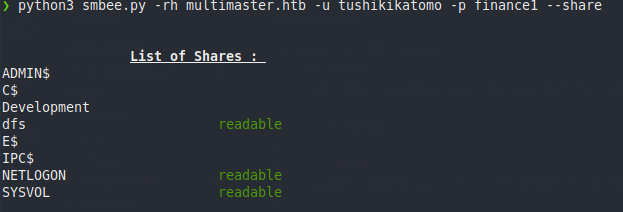
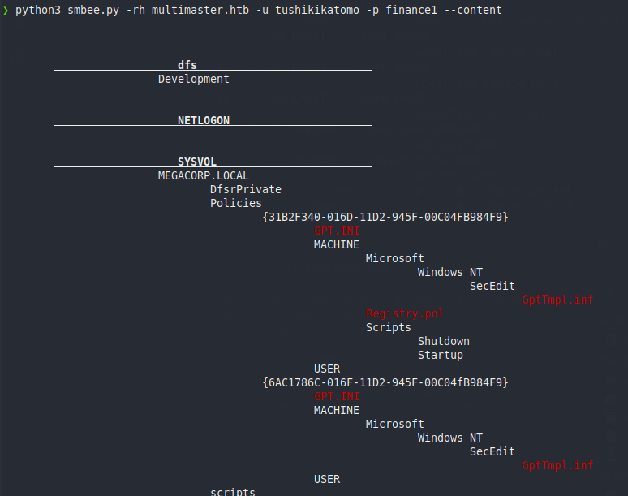
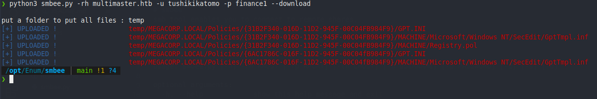

# smbee
smb tool enables you to connect to remote shares.

[+] USAGE : 

```bash
usage: smbee.py [-h] -rh RHOST [-rp RPORT] [-lh LHOST] [-u USERNAME] [-p PASSWORD] [-c] [-s] [-d]

optional arguments:
  -h, --help            show this help message and exit
  -rh RHOST, --rhost RHOST
                        specifies remote host
  -rp RPORT, --rport RPORT
                        specifies remote port
  -lh LHOST, --lhost LHOST
                        specifies local host
  -u USERNAME, --username USERNAME
                        set username
  -p PASSWORD, --password PASSWORD
                        set password
  -c, --content         print all share content
  -s, --share           print all shares and if it's writeable or readable
  -d, --download        download all files
  ```
  
  **[+] INSTALLATION :**
  
  `git clone https://github.com/Arvialo/smbee`<br>
  `cd smbee/`<br>
  `pip3 install smb`
  
  **[+] EXAMPLES :**
  <br>
  <br>
  
  
  
